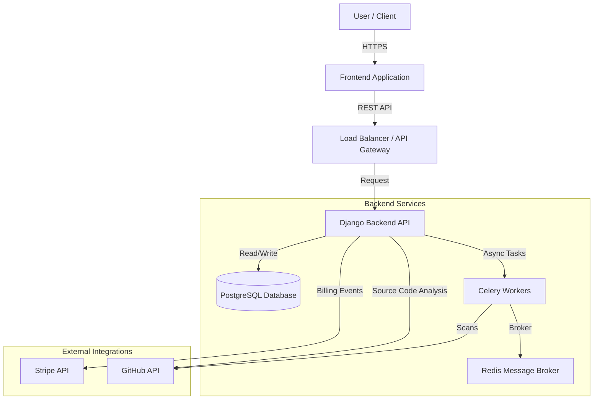

# System Architecture Document

## 1. High-Level Architecture

AuditMate follows a modern **B2B SaaS Architecture**, structured as a decoupled frontend and backend system.

### Key Components
*   **Frontend**: React/Vue-based Single Page Application (SPA). Handles UI, client-side routing, and interacts with the backend via REST API.
*   **Backend**: Django REST Framework (DRF) application. Manages business logic, authentication, data persistence, and external integrations.
*   **Database**: PostgreSQL for relational data storage (Users, Organizations, Audits, Evidence).
*   **Async Workers**: Celery workers using Redis as a broker for handling long-running tasks like security scans and PDF report generation.

## 2. Technology Stack

| Component | Technology | Description |
| :--- | :--- | :--- |
| **Backend Framework** | Django 5.2 + Django REST Framework 3.16 | Robust, secure, and scalable web framework. |
| **Language** | Python 3.x | Primary language for backend logic and scripts. |
| **Database** | PostgreSQL | Relational database for structured data. |
| **Task Queue** | Celery 5.6 | Distributed task queue for background processing. |
| **Message Broker** | Redis 7.1 | In-memory data structure store used as a message broker for Celery. |
| **Authentication** | JWT (SimpleJWT) + Session | Secure authentication mechanisms. |
| **Documentation** | OpenAPI / Swagger (via drf-spectacular) | API documentation and testing tools. |
| **External APIs** | Stripe, GitHub, AWS | Payment processing, code integration, and cloud services. |

## 3. Monolith vs Microservices

**Current Architecture: Modular Monolith**

The application is designed as a **Modular Monolith**. This approach was chosen to balance development speed, complexity, and scalability.
*   **Why Monolith?** robust, easier to deploy, simpler testing, and reduced operational overhead compared to microservices at this stage.
*   **Modularity:** The codebase is organized into distinct Django "Apps" (`audits`, `billing`, `organizations`, `users`) which encapsulate specific domains. This allows for logical separation of concerns and easier potential migration to microservices in the future if needed.

## 4. Data Flow

### User Request Flow
1.  **Client Application** sends an HTTPS request (e.g., `GET /api/v1/audits/`) with a JWT Bearer token.
2.  **Django Middleware** intercepts the request for security checks (allowed hosts, CORS).
3.  **Authentication Layer** validates the JWT token.
4.  **Permission Layer** checks:
    *   `IsAuthenticated`: Is the user logged in?
    *   `IsSameOrganization`: Does the user belong to the requested resource's organization?
    *   `HasActiveSubscription`: (For premium features) Is the organization's subscription active?
5.  **View/Controller** processes the request, queries the database via ORM, and serializes the data.
6.  **Response** is returned to the client as JSON.

### Async Task Flow (Audit Scans)
1.  **User** initiates a scan via API (`POST /api/v1/audits/start/`).
2.  **API** creates a `PENDING` Audit record and dispatches a Celery task. Returns `202 Accepted`.
3.  **Celery Worker** picks up the task from Redis.
4.  **Worker** executes security checks (e.g., calling GitHub API).
5.  **Worker** updates the Audit record with results (`PASS`/`FAIL`) and creates Evidence records.
6.  **Frontend** polls for status updates or receives a notification.

## 5. Third-Party Integrations

### Stripe (Billing)
*   **Deep Integration**: Handles subscriptions, invoicing, and checkout flows.
*   **Webhooks**: Listens for events like `checkout.session.completed` and `customer.subscription.deleted` to automatically update organization status in the local database.

### GitHub (Audit Source)
*   **OAuth2**: Used for connecting user accounts and obtaining access tokens.
*   **API v3 (REST)**: Used to fetch repository data, check settings, and analyze code for security compliance.

### AWS (Infrastructure - Potential)
*   Used for hosting (S3 for artifacts, RDS for DB) via `boto3`.

## 6. Security Model

### Authentication
*   **JWT (JSON Web Tokens)**: Primary method for API authentication.
*   **Session Auth**: Supported for Django Admin and browser-based sessions.

### Authorization (RBAC)
*   **Organization Isolation**: Strict implementation ensuring users can *only* access data within their own organization (`IsSameOrganization` permission).
*   **Roles**:
    *   `ADMIN`: Full access to organization settings, billing, and user management.
    *   `MEMBER`: Can run audits and view results.
    *   `VIEWER`: Read-only access to reports.

### Data Security
*   **Encryption**: Sensitive keys (like integration tokens) are encrypted at rest using `fernet` (via `cryptography` library) or environment variable management best practices.
*   **HTTPS**: Enforced for all communications.
