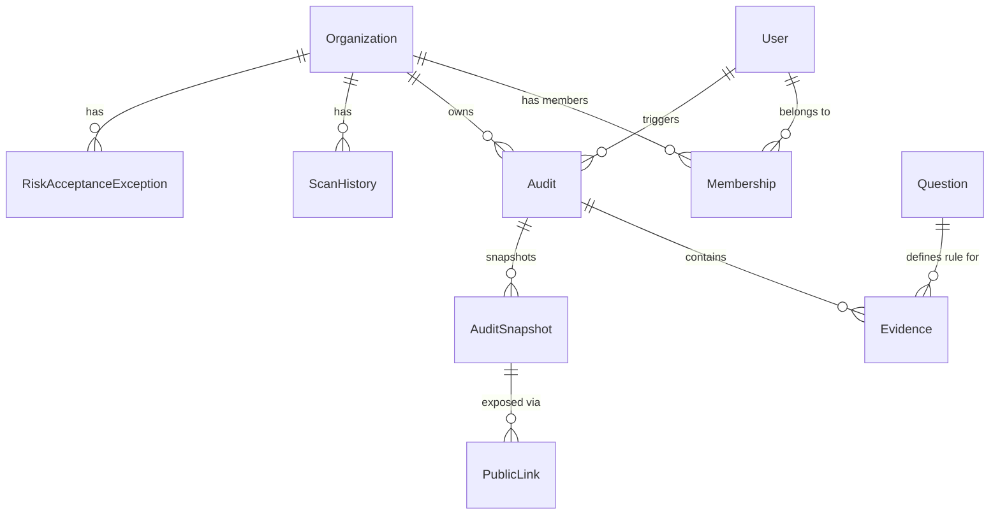

# Database Design Document

## 1. Overview
The database is built on **PostgreSQL**, taking advantage of its relational integrity, JSONB support (for unstructured evidence data), and transactional reliability.

## 2. Entity-Relationship Diagram (ERD)

## 3. Key Tables & Schema

### Organizations Application

#### `Organization` (Tenants)
*   **id**: UUID (PK)
*   **name**: String
*   **slug**: String (Unique, Indexed)
*   **owner**: FK -> User
*   **subscription_status**: String ('free', 'active', etc.)
*   **stripe_customer_id**: String (Indexed)

#### `Membership` (RBAC)
*   **id**: UUID (PK)
*   **user**: FK -> User
*   **organization**: FK -> Organization
*   **role**: Enum ('admin', 'member', 'viewer')
*   *Note: Unique constraint on (user, organization)*

### Audits Application

#### `Audit` (Scan Sessions)
*   **id**: UUID (PK)
*   **organization**: FK -> Organization (Indexed)
*   **status**: Enum ('PENDING', 'RUNNING', 'COMPLETED', 'FAILED')
*   **score**: Integer (0-100)
*   **created_at**: DateTime (Indexed)

#### `Evidence` (Findings)
*   **id**: ID (Auto)
*   **audit**: FK -> Audit (Cascade)
*   **question**: FK -> Question
*   **status**: Enum ('PASS', 'FAIL', 'RISK_ACCEPTED')
*   **raw_data**: JSONB (Stores API responses from GitHub/AWS)
*   **screenshot**: ImageField (Path to proof file)
*   **remediation_steps**: Text

#### `AuditSnapshot` (Immutable History)
*   **id**: ID (Auto)
*   **audit**: FK -> Audit
*   **data**: JSONB (Full dump of audit + evidence at point in time)
*   **checksum**: SHA256 (Data integrity verification)
*   **is_pinned**: Boolean (Retain indefinitely)

#### `ScanHistory` (Analytics)
*   **organization**: FK -> Organization
*   **date**: Date
*   **score**: Integer
*   **total_pass/fail**: Integer

## 4. JSONB Usage
We use PostgreSQL's `JSONB` field type for the `Evidence.raw_data` column.
*   **Reason**: Different security checks return vastly different data structures (e.g., a "GitHub 2FA" check returns a boolean and user list, while a "S3 Bucket Public" check returns policy documents).
*   **Benefit**: Allows storing arbitrary schema-less proof data without creating hundreds of EAV tables.

## 5. Indexing Strategy
Indexes are critical for performance, especially for multi-tenant isolation queries.

| Table | Index Columns | Purpose |
| :--- | :--- | :--- |
| `Organization` | `slug` | Fast lookup by URL slug |
| `Organization` | `owner` | Quickly find orgs owned by user |
| `Membership` | `user`, `organization` | Fast permission checks (IsSameOrganization) |
| `Audit` | `organization`, `created_at` | Efficiently list recent audits for dashboard |
| `Evidence` | `audit`, `status` | Fast filtering of "Failed" checks within an audit |

## 6. Migration Strategy
*   Powered by **Django Migrations**.
*   **Workflow**:
    1.  Modify `models.py`.
    2.  Run `makemigrations`.
    3.  Review generated migration script.
    4.  Run `migrate` (applied automatically in CI/CD pipeline or manually in prod).
